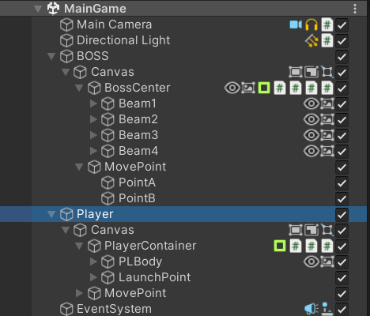
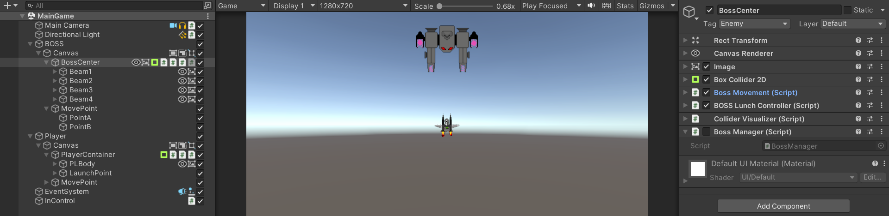

# Read Me
UnityのHierarchyにコンポーネントのアイコンを追加し、オンオフを切り替える機能や、<br>
オブジェクトの表示・非表示を切り替える機能をつけることができます。<br>
<br>
オフにすると下記イメージの様に、Inspectorの方でもオフになる。<br>
オフの時はアイコンが少し灰色がかった(?)色になる。<br>
<br>

どこに何のコンポーネントが追加されているのかが分かりにくく感じたので、作成しました。

## 使い方

①「Editor」というフォルダをダウンロードする<br>
②「Assets」フォルダにダウンロードしたファイルを入れる<br>
③終わり！！<br>

```
Assets
├Editor
│　 └BreadcrumbsDrawComponentIconInHierarchy.cs
```

この様なフォルダ構成になっていたら成功です。
